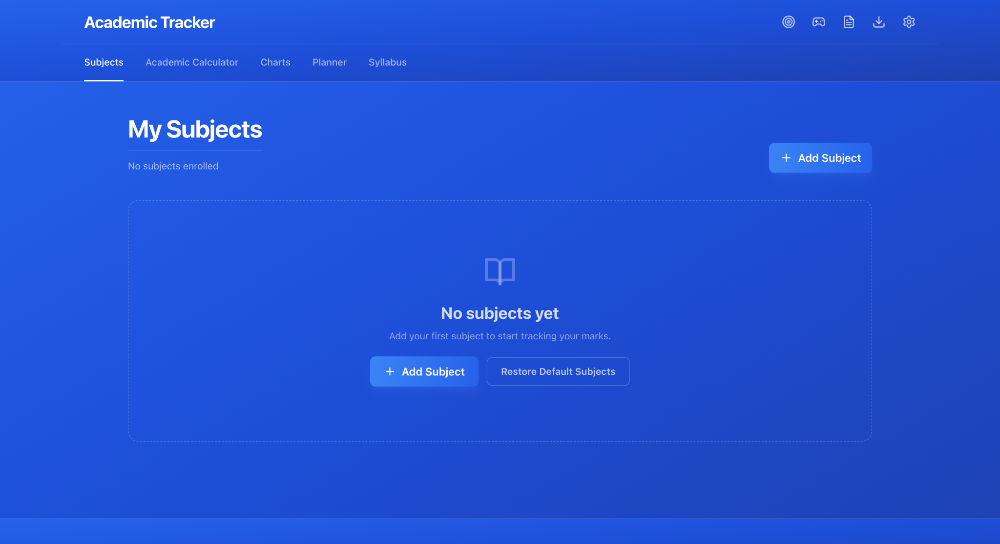

# 🎓 Academic Tracker

> **A powerful client-side academic dashboard for tracking marks, calculating GPA/CGPA, analyzing performance, planning study sessions, and preparing for exams — built specifically around the VIT 10-point grading system.**

<p align="center">
  <a href="https://academic-tracker-swart.vercel.app/">
    <strong>🚀 Live Demo</strong>
  </a>
  &nbsp;&nbsp;•&nbsp;&nbsp;
  <a href="https://github.com/ArhamChoudhary-ui/Academic-Tracker">
    <strong>💻 Source Code</strong>
  </a>
</p>

---

## Preview

<p align="center">
  
</p>

<p align="center">
  <em>Track your academic performance from one centralized dashboard.</em>
</p>


---

##  Why Academic Tracker?

University students often have their academic information scattered across spreadsheets, LMS portals, notes, calculators, and calendars.

**Academic Tracker brings it together in one place.**

It lets you:

* Track CATs, quizzes, assignments, FATs, labs, and internals
* Calculate weighted internal marks automatically
* Calculate semester GPA and cumulative CGPA
* Visualize academic performance
* Calculate the marks required to reach a target grade
* Estimate required FAT performance
* Organize syllabi and revision material
* Track focused study sessions
* Plan assignments, exams, and study milestones
* Generate revision notes and practice questions from uploaded syllabi
* Take a quick break with the built-in Tetris game

And most importantly:

> **Your academic data stays on your device.**

---

# Features

## 1. Academic Performance Tracking

Track academic performance on a **subject-by-subject basis**.

Each subject can contain:

* CAT-1
* CAT-2
* FAT
* Lab
* Quizzes
* Assignments
* Case studies
* Projects
* Custom internal components

### Flexible Internal Assessment

Choose from predefined structures or configure your own:

| Structure         |       Weight |
| ----------------- | -----------: |
| Three Quizzes     | 10 + 10 + 10 |
| Case Study + Quiz |      20 + 10 |
| Term Project      |           30 |
| Dual Assignments  |      15 + 15 |

The application automatically scales assessment marks according to the configured academic structure.

---

# 2. VIT GPA & CGPA Calculator

Academic Tracker includes a credit-weighted GPA calculator based on the **VIT 10-point grading system**.

### Grade Scale

| Grade | Grade Points |
| :---: | -----------: |
|   S   |           10 |
|   A   |            9 |
|   B   |            8 |
|   C   |            7 |
|   D   |            6 |
|   E   |            5 |
|   F   |            0 |

### Semester GPA

The GPA is calculated using:

```text
GPA = Σ(Credit × Grade Point) / Σ(Credits)
```

### Cumulative CGPA

CGPA is calculated using the credit-weighted semester values:

```text
CGPA =
Σ(Semester GPA × Semester Credits)
──────────────────────────────────
        Σ(Semester Credits)
```

This avoids incorrectly treating every semester as having equal weight.

---

# 📈 3. Performance Analytics

Turn raw marks into useful visual insights.

Academic Tracker provides:

* Bar charts
* Performance trends
* Score distributions
* Multi-dimensional performance visualization
* Subject-level comparisons
* Academic summary reports

You can analyze both:

**Raw assessment performance**

and

**Scaled academic performance.**

---

# 4. Goal Calculator

Wondering:

> **"What do I need in FAT to get an A?"**

The Goal Calculator works backwards from your target overall score.

You provide:

* Current assessment scores
* Target overall percentage
* Remaining assessment weight

The application calculates the required score in the remaining assessment.

### Example

```text
Current Score      → 62%
Target Score       → 75%
Remaining Weight   → 40%

Required FAT Score → calculated automatically
```

This turns the tracker into a planning tool rather than just a marks calculator.

---

# 5. FAT Prediction & Benchmarks

Academic Tracker can use previous performance data to provide projected FAT requirements and benchmarks.

You can compare your performance against:

* Previous assessments
* Class averages
* Target performance
* Expected final outcomes

This helps answer questions such as:

> "How much do I need in my FAT to reach my target?"

---

# 6. Study Planner & Focus Timer

Academic Tracker also includes a built-in study workflow.

### Pomodoro Focus Timer

Features include:

* Custom work duration
* Custom break duration
* Completion notifications
* Study session logging
* Daily study tracking
* Study streaks

### Study Planner

Plan:

* Study sessions
* Assignments
* Exams
* Syllabus milestones

---

# 7. Syllabus Document Hub

Upload course syllabi directly into Academic Tracker.

Powered by **PDF.js**, the document hub supports client-side PDF processing.

### Features

* Upload syllabus PDFs
* View documents
* Clean document names
* Extract syllabus text
* Build revision notes
* Generate practice questions
* Generate key definitions

All processing happens locally in the browser.

---

# 8. Break Mode

Studying too long?

Take a break.

Academic Tracker includes a built-in **Tetris mini-game** accessible from the navigation bar.

Because sometimes the best productivity feature is knowing when to stop studying for five minutes. 😭

---

# Privacy First

Academic Tracker is designed around a **client-side-first architecture**.

### Your data stays local.

* No account required
* No mandatory backend
* No database required
* No advertising
* No analytics trackers
* No third-party tracking scripts
* Academic calculations run locally
* PDF processing runs locally
* Study sessions are stored locally

Your academic information does not need to leave your machine.

---

# Tech Stack

| Category          | Technology               |
| ----------------- | ------------------------ |
| Frontend          | React 18                 |
| Build Tool        | Vite 5                   |
| Styling           | Tailwind CSS 3           |
| Icons             | Lucide React             |
| Charts            | Recharts                 |
| PDF Processing    | PDF.js                   |
| Testing           | Vitest                   |
| Component Testing | Testing Library          |
| Client Storage    | LocalStorage / IndexedDB |
| Security          | Web Crypto API           |
| CI                | GitHub Actions           |

---

# Architecture

Academic Tracker follows a modular client-side architecture.

```text
                         ┌─────────────────────┐
                         │   Academic Tracker  │
                         └──────────┬──────────┘
                                    │
              ┌─────────────────────┼─────────────────────┐
              │                     │                     │
              ▼                     ▼                     ▼
      ┌───────────────┐     ┌───────────────┐     ┌───────────────┐
      │ Academic Core │     │ Study Planner │     │ Syllabus Hub  │
      └───────┬───────┘     └───────┬───────┘     └───────┬───────┘
              │                     │                     │
              ▼                     ▼                     ▼
      ┌───────────────┐     ┌───────────────┐     ┌───────────────┐
      │ Calculations  │     │ Study Sessions│     │ PDF.js        │
      │ GPA / CGPA    │     │ Timer / Tasks │     │ Text Extractor│
      └───────┬───────┘     └───────┬───────┘     └───────┬───────┘
              │                     │                     │
              └─────────────────────┼─────────────────────┘
                                    ▼
                         ┌─────────────────────┐
                         │ Local Persistence   │
                         │ LocalStorage / IDB  │
                         └─────────────────────┘
```

---

# Project Structure

```text
Academic-Tracker/
│
├── src/
│   ├── components/
│   │   ├── academicCalculator/
│   │   ├── credit/
│   │   ├── shared/
│   │   ├── timer/
│   │   │
│   │   ├── AcademicCalculator.jsx
│   │   ├── Charts.jsx
│   │   ├── GoalCalculator.jsx
│   │   ├── SubjectCard.jsx
│   │   ├── SubjectPlanner.jsx
│   │   ├── SyllabusPdfHub.jsx
│   │   └── TetrisGame.jsx
│   │
│   ├── hooks/
│   ├── tests/
│   ├── utils/
│   │
│   ├── App.jsx
│   └── main.jsx
│
├── assets/
├── docs/
├── public/
│
├── .github/
│   └── workflows/
│       └── ci.yml
│
├── index.html
├── package.json
├── tailwind.config.js
├── vite.config.js
└── vitest.config.js
```

---

# Core Calculations

Academic Tracker contains a dedicated calculation layer rather than putting academic logic directly inside UI components.

Examples include:

```text
Assessment Scaling
        ↓
Internal Score Calculation
        ↓
Overall Subject Score
        ↓
Grade Mapping
        ↓
Grade Points
        ↓
Semester GPA
        ↓
Cumulative CGPA
```

This separation keeps the UI focused on presentation while the calculation utilities handle academic logic.

---

# Testing

The project uses **Vitest** and **Testing Library**.

Run the test suite:

```bash
npm test
```

Run tests in watch mode:

```bash
npm run test:watch
```

Production build:

```bash
npm run build
```

Preview the production build:

```bash
npm run preview
```

---

# ⚡ Getting Started

## Prerequisites

Make sure you have:

* Node.js 18+
* npm 9+

Check your versions:

```bash
node --version
npm --version
```

---

## Installation

Clone the repository:

```bash
git clone https://github.com/ArhamChoudhary-ui/Academic-Tracker.git
```

Enter the project:

```bash
cd Academic-Tracker
```

Install dependencies:

```bash
npm install --legacy-peer-deps
```

Start the development server:

```bash
npm run dev
```

Open:

```text
http://localhost:5173
```

---

# Available Scripts

| Command              | Description              |
| -------------------- | ------------------------ |
| `npm run dev`        | Start development server |
| `npm run build`      | Create production build  |
| `npm run preview`    | Preview production build |
| `npm test`           | Run test suite           |
| `npm run test:watch` | Run tests in watch mode  |

---

# 🗺️ Roadmap

Academic Tracker is actively evolving.

### Completed

* [x] Subject management
* [x] Assessment tracking
* [x] VIT GPA calculator
* [x] CGPA calculator
* [x] Performance analytics
* [x] Goal calculator
* [x] FAT prediction
* [x] Study timer
* [x] Study planner
* [x] Syllabus PDF hub
* [x] Practice question generation
* [x] Notes generation
* [x] CSV export
* [x] Dark / light interface
* [x] Responsive design
* [x] Automated testing
* [x] CI pipeline

### Planned

* [ ] More university grading presets
* [ ] Improved academic forecasting
* [ ] More advanced performance analytics
* [ ] Cloud synchronization
* [ ] Multi-device support
* [ ] Enhanced study analytics
* [ ] More customizable dashboards
* [ ] Mobile-focused experience

---

# Design Philosophy

Academic Tracker is built around three principles:

### 1. Simple

Academic information should be easier to understand than a spreadsheet.

### 2. Useful

Every calculation and visualization should answer a practical student question.

### 3. Private

Academic data should remain under the student's control.

---

# Author

**Arham Choudhary**

B.Tech Information Technology

Interested in:

* Full-Stack Development
* Artificial Intelligence & Machine Learning
* Data Structures & Algorithms
* Developer Tools
* Building practical software

---

# Support

If you find Academic Tracker useful:

**Star the repository**

**Report an issue**

**Suggest a feature**

**Contribute**

---

## License

This project is open-source and available under the repository's license.

---

<p align="center">
  <strong>Built with React  • Vite • Tailwind CSS </strong>
</p>

<p align="center">
  <em>Track smarter. Study better. Know where you stand.</em>
</p>
